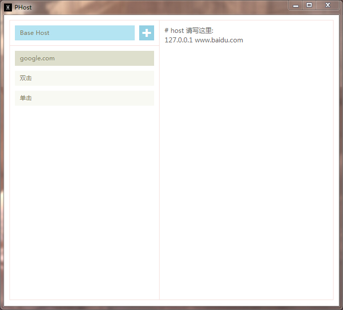

PHost
=====

PHost - 利用 nodeWebkit 制作，方便host切换与调试的工具

### 设计方面
- 界面和交互看起来简单，但其实在实现过程中，需要花很多的心血，一点都不比code时间少。
- 用色尽量简洁，复杂的我也搞不出来 :(
- 以后有可能会进行微调整，看用户的反馈吧

### 体验方面
- 常用的功能都有：新增，删除，修改，编辑等
- 编辑host是实时的，不需要点什么按钮
- 当host名称太长时，会自动添加title属性。不长时不添加，以免干扰
- 虽然没有太多的文字说明，但清晰明了，这也是我一向推崇的设计原则，并尽力去实践

### 代码方面
1. 第一版是动态生成txt和读取txt的方法，后来又改为全``localStorage``版
2. 当初遇到中文编码问题，没有使用``iconv``，可以在写入中文时进行``encodeURI``,读取时再进行``decodeURI``就可以了
3. 使用了第3方``xss``组件，自己也做了一些过滤，以免用户输入了可以执行的host名称

### 心得体会
1. design + code = paper
2. 全包，确实辛苦，但做起来很爽，完全不知疲惫！因为设计、交互、用户体验、代码全在一个人身上，完全可以按照自己的想法去实践。
3. 尽量去做自己喜欢且有成就感的事情！

---

### bug提交地址
https://github.com/paper/PHost/issues

### changelog

###### 0.2.0
1. 系统盘现在不仅仅适应C盘
2. 修复了2个体验：
	- 新增host时，焦点定位问题
	- 如果你已经双击了某个host，当你修改base-host时，不需要**再次**双击才能应用到系统了 :D

3. 格式化了代码，在github线上看代码更美观

###### 0.1.1
1. 解决window版本换行问题 ``\n`` -> ``\r\n``

###### 0.1.0
1. 目前只针对window版本
2. 目前只测试了win7，系统盘在C盘 （后续会修改代码，以适应不同的系统盘）
